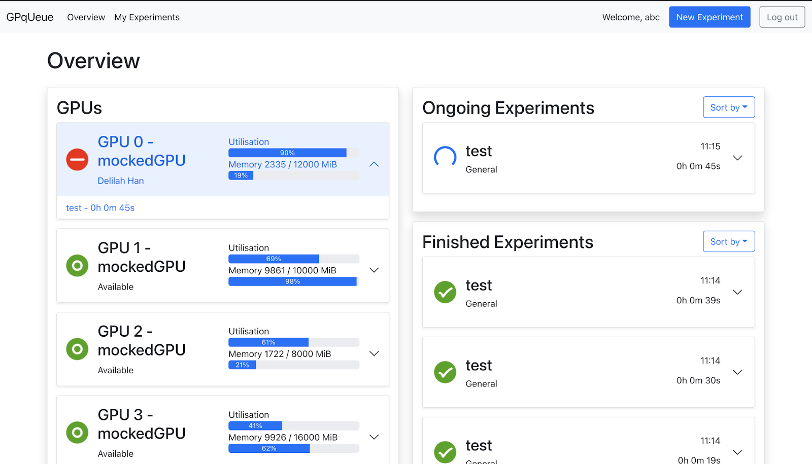
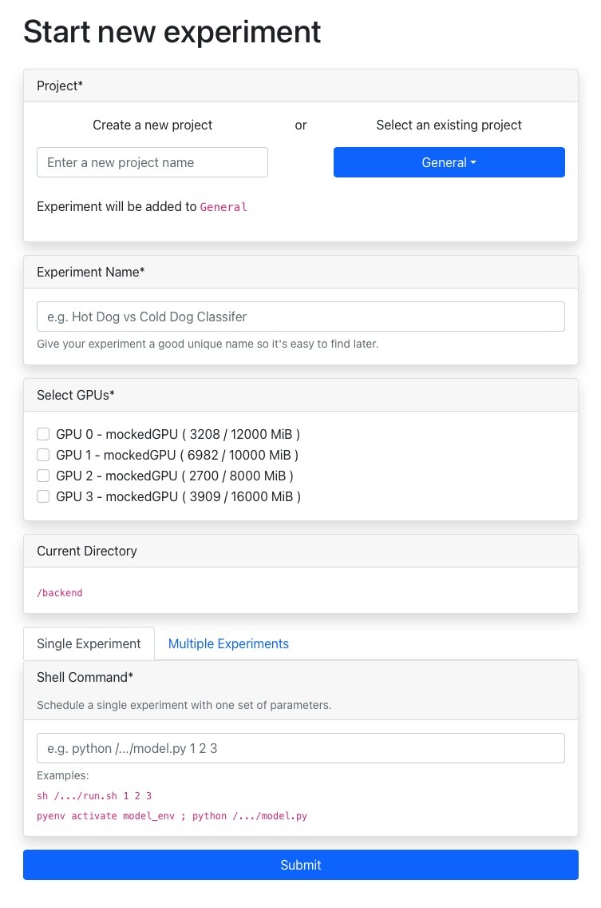
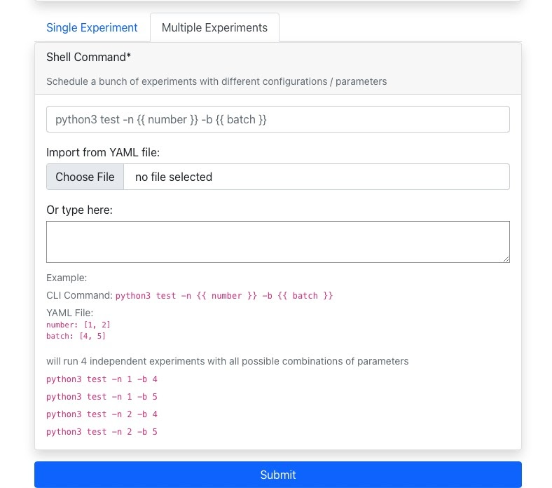

# GPqUeue

We are a self-hosted platform that allows AI researchers to efficiently share GPUs and schedule the execution of their scripts.

You can use GPqUeue to:

1. Schedule a set of experiments across different GPUs.
1. Launch training jobs with different hyperparameters.
1. Track the progress of your ongoing experiments.
1. Enable safe GPU sharing between multiple researchers.

**Please note that this project is in an alpha version - currently it supports launching only using Docker Compose**

# Usage

## Setup
Launch GPqUeue on your own cluster of GPUs using the following command:

`./start-stag.sh`

This should start a new instance of GPqUeue that is now available at `localhost`. 

## Login
You can then create an account and log in. That will take you to the main overview page, where you can see:

1. Currently available GPUs and their status
1. List of queued and completed experiments
1. An option to launch a new experiment.

## Launching an experiment

GPqUeue support both launching a single and multiple experiments.

To launch multiple experiments, you need to provide a yaml-like configuration file that allows to specify multiple values for some parameters:

# Architecture

The project is based on Python 3.9, as well as ReactJS and Redis. 

# Acknowledgements

Thanks a lot to the team at the Imperial College London and Royal College of Art that supervised this project as part of the "Design for Real People" module.
